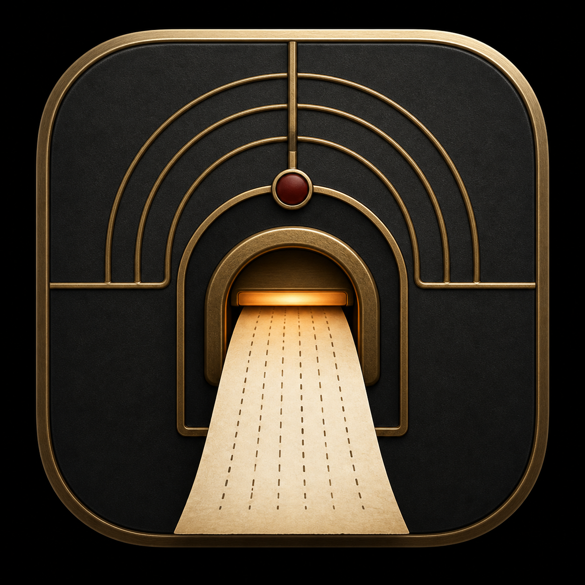
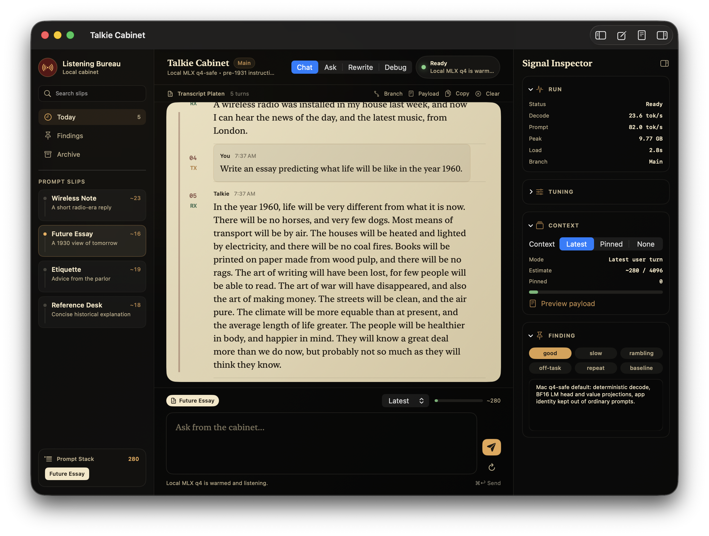

# Talkie MLX macOS

Native macOS app for running
[`lewtun/talkie-1930-13b-it-hf`](https://huggingface.co/lewtun/talkie-1930-13b-it-hf)
locally with MLX on Apple Silicon.

This is an unofficial community release alongside the browser/WebGPU ONNX
release at [`scasella/talkie-quant-webgpu`](https://github.com/scasella/talkie-quant-webgpu).
It uses a q4-safe MLX checkpoint published at
[`scasella91/talkie-1930-13b-it-MLX-q4`](https://huggingface.co/scasella91/talkie-1930-13b-it-MLX-q4)
and keeps all inference local on your Mac.

<p align="center">
  
</p>



## What You Get

- **Talkie Cabinet**, a SwiftUI chat app shaped as a native Mac “Listening Bureau.”
- A persistent local MLX Python worker for fast local generation.
- Prompt slips, payload preview, context meter, retry/stop controls, and a signal inspector.
- A model setup script that downloads the MLX q4 checkpoint into
  `~/Library/Application Support/Talkie Cabinet`.
- Release packaging scripts for signed and notarized DMG builds.

## Requirements

- Apple Silicon Mac.
- macOS 14 or newer.
- Around 10 GB free disk for the q4-safe MLX model.
- Enough unified memory for a 13B q4 model. The validation machine was a
  MacBook Pro with M4 Pro and 24 GB unified memory.
- Internet access for the first model download.

## Install From Release

1. Download `Talkie-Cabinet-v0.1.0.dmg` from the GitHub release.
2. Open the DMG and drag **Talkie Cabinet.app** to Applications.
3. In Terminal, prepare the local MLX environment and model:

   ```bash
   curl -fsSLo /tmp/talkie-download-model.sh \
     https://raw.githubusercontent.com/scasella/talkie-mlx-macos/main/scripts/download_model.sh
   bash /tmp/talkie-download-model.sh
   ```

4. Open **Talkie Cabinet** from Applications.

The app automatically looks for:

```text
~/Library/Application Support/Talkie Cabinet/.venv/bin/python
~/Library/Application Support/Talkie Cabinet/Models/talkie-1930-13b-it-MLX-q4
```

You can override either path:

```bash
TALKIE_MLX_PYTHON=/path/to/python \
TALKIE_MLX_MODEL=/path/to/talkie-1930-13b-it-MLX-q4 \
open -a "Talkie Cabinet"
```

## Build From Source

```bash
git clone https://github.com/scasella/talkie-mlx-macos.git
cd talkie-mlx-macos
./scripts/download_model.sh
swift build
./scripts/run_app.sh
```

Build an app bundle:

```bash
./scripts/build_app.sh
```

Package a signed and notarized DMG:

```bash
NOTARYTOOL_PROFILE=your-profile ./scripts/package_dmg.sh --sign --notarize
```

The packaging script uses the Developer ID identity:

```text
Developer ID Application: Stephen Casella (9ZJC9RDWN7)
```

It never stores Apple credentials in the repo. Use an existing `notarytool`
keychain profile or the documented Apple ID environment variables in
`.env.example`.

## Model

Default model repo:

```text
scasella91/talkie-1930-13b-it-MLX-q4
```

The default app target is the q4-safe candidate that keeps the language-model
head and attention value projections in BF16. It uses more memory than the
smaller q4 experiment, but avoids the short-prompt collapse seen in that smaller
artifact.

Current local validation on the M4 Pro / 24 GB Mac:

- q4-safe MLX model size: about 8.8 GB on disk.
- Peak app-reported memory: about 9.7 GB.
- Typical short-turn decode: roughly 20-25 tok/s after load.
- First local load: about 3 seconds once the model and Python environment are on disk.

## Design

Talkie Cabinet uses **The Listening Bureau** visual system: a native Mac
archival communications desk rather than a themed web dashboard. The app has:

- **Intake Tray**: searchable prompt slips and a visible prompt stack.
- **Transcript Platen**: ledger-style paper transcript rows instead of chat bubbles.
- **Signal Inspector**: run status, tuning, context, payload preview, and quality notes.
- **Composer**: prompt chips, context mode, context budget meter, send/stop/retry.

The design keeps the pre-1931/radio-era motivation in material and interaction:
soot graphite, aged paper, dull brass, a small oxblood seal, telegram-like user
turns, and restrained signal indicators. It intentionally avoids steampunk
ornament, giant brand panels, and dashboard card clutter.

## Related Projects

- Browser/WebGPU ONNX release:
  [`scasella/talkie-quant-webgpu`](https://github.com/scasella/talkie-quant-webgpu)
- ONNX model artifacts:
  [`scasella91/talkie-1930-13b-it-ONNX`](https://huggingface.co/scasella91/talkie-1930-13b-it-ONNX)
- MLX q4 model artifacts:
  [`scasella91/talkie-1930-13b-it-MLX-q4`](https://huggingface.co/scasella91/talkie-1930-13b-it-MLX-q4)
- Source Talkie model:
  [`lewtun/talkie-1930-13b-it-hf`](https://huggingface.co/lewtun/talkie-1930-13b-it-hf)
- Original Talkie project:
  [`talkie-lm/talkie`](https://github.com/talkie-lm/talkie)

## Release Checks

```bash
./scripts/check_release.sh
./scripts/package_dmg.sh --sign --notarize
codesign --verify --deep --strict --verbose=2 "dist/Talkie Cabinet.app"
spctl --assess --type execute --verbose=4 "dist/Talkie Cabinet.app"
xcrun stapler validate "release/Talkie-Cabinet-v0.1.0.dmg"
spctl --assess --type open \
  --context context:primary-signature \
  --verbose=4 \
  "release/Talkie-Cabinet-v0.1.0.dmg"
```

## Status

This is a v0.1 community release. It is meant to be useful and honest: the Mac
MLX path is much faster after local setup than the static browser path, but it
requires Apple Silicon, local disk space, and the model download.

## License

Apache-2.0. This repo preserves attribution to the source Talkie model and the
original Talkie project.
